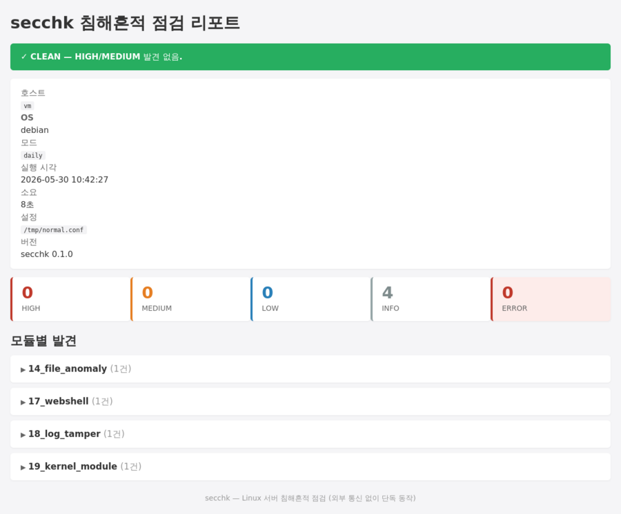
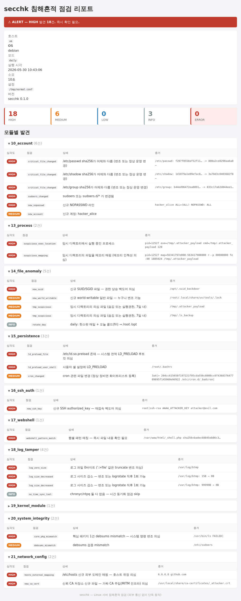
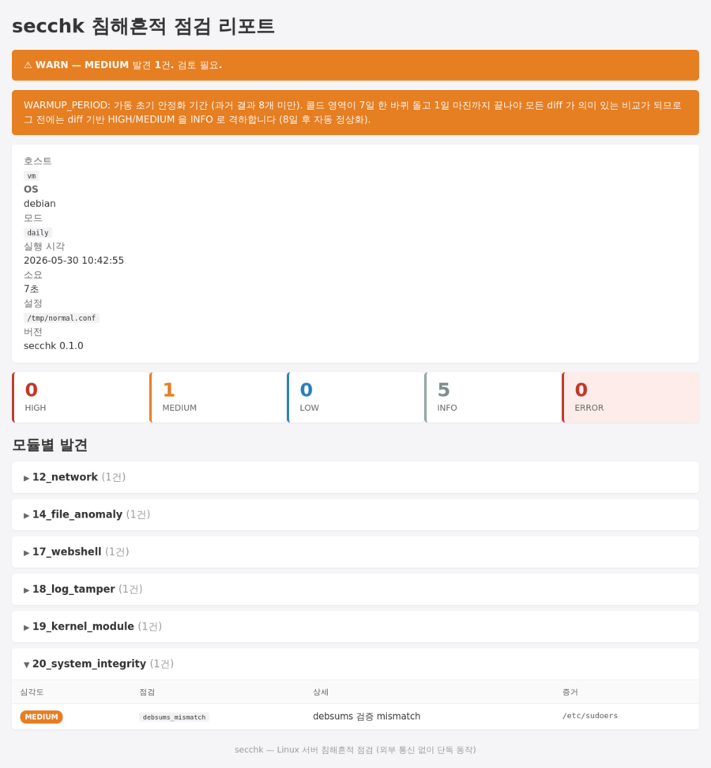

# secchk — Linux 서버 침해흔적 점검 스크립트

매일 1회 cron으로 자동 실행되어 호스트 내부의 침해 흔적을 찾아내고, 결과를 로컬에 저장하면 운영자가 SSH로 회수하는 단일 쉘 스크립트입니다. 외부 통신 없이 동작하므로 오프라인 환경에서도 그대로 사용할 수 있습니다.

---

## 목차

**시작하기**
- [1. 한 줄 소개](#1-한-줄-소개)
- [2. 이 도구의 성격](#2-이-도구의-성격)
- [3. 동작 방식 한눈에](#3-동작-방식-한눈에)

**설치와 일상 운영**
- [4. 빠른 시작 (3분 체크리스트)](#4-빠른-시작-3분-체크리스트)
- [5. 결과 화면 예시](#5-결과-화면-예시)
- [6. 매일 운영 루틴](#6-매일-운영-루틴)
- [7. 설정 (secchk.conf)](#7-설정-secchkconf)
- [8. ClamAV 시그니처 USB 반입 절차](#8-clamav-시그니처-usb-반입-절차)

**점검 기능**
- [9. 점검 모듈 16개](#9-점검-모듈-16개)
- [10. 침해 탐지 예시](#10-침해-탐지-예시)
- [11. 결과 산출물 구조](#11-결과-산출물-구조)
- [12. 첫 8일 — WARMUP_PERIOD](#12-첫-8일--warmup_period)

**사고 대응과 도구의 한계**
- [13. HIGH 발견 시 대응](#13-high-발견-시-대응)
- [14. 자주 묻는 질문 (FAQ)](#14-자주-묻는-질문-faq)
- [15. 이 도구의 한계와 보완 방법](#15-이-도구의-한계와-보완-방법)

**참고**
- [16. 빌드 / 개발자 가이드](#16-빌드--개발자-가이드)
- [17. 폴더 / 파일 레이아웃](#17-폴더--파일-레이아웃)
- [18. 용어집](#18-용어집)

---

## 1. 한 줄 소개

방화벽·WAF·IDS 같은 네트워크 장비만으로는 "이 서버 내부가 실제로 침해됐는가?"를 알기 어렵습니다. 이 도구는 각 서버에서 자체적으로 침해의 흔적을 찾는 16종 점검을 매일 1회 수행하고, 결과를 운영자가 매일 1분 안에 확인할 수 있는 형태로 정리해줍니다.

---

## 2. 이 도구의 성격

| 항목 | 내용 |
|---|---|
| 동작 방식 | 각 서버에서 cron으로 매일 1회 실행 |
| 통신 | 외부 통신 0건 (외부 통신 없이 단독 동작 (오프라인 환경 포함)) |
| 결과 회수 | 로컬 파일로 저장, 운영자가 SSH로 직접 회수 |
| 배포 단위 | 단일 파일 `secchk.sh` 하나만 USB로 반입 |
| 외부 의존성 | ClamAV 시그니처만 USB로 정기 반입 (옵션, `--no-clamav`로 끌 수 있음) |
| 대상 OS | RHEL/CentOS 계열, Ubuntu/Debian 계열 (자동 감지) |
| 권한 | root로 실행 (시스템 파일 접근 필요) |

이 도구는 **침해를 발견하는 도구**이지 **차단하는 도구가 아닙니다**. 발견된 신호를 보고 다음 행동(보존·격리·포렌식)을 결정하는 것은 운영자의 SOP입니다.

---

## 3. 동작 방식 한눈에

```text
                  ┌──────────────────────────────────┐
                  │  매일 03:30 cron                  │
                  └─────────────┬────────────────────┘
                                ▼
   ┌──────────────────────────────────────────────────────────┐
   │  secchk.sh --mode daily                                  │
   │                                                          │
   │  16개 모듈 순차 실행                                       │
   │   ├─ 계정 / 로그인 / 네트워크 / 프로세스                 │
   │   ├─ 파일 이상 / 지속성 / SSH 인증 / 웹쉘                │
   │   ├─ 로그 변조 / 커널 모듈 / 패키지 무결성               │
   │   ├─ 네트워크 설정 / 메일 큐 / 컨테이너                  │
   │   ├─ ClamAV / rkhunter(옵션)                             │
   │   └─ 결과 비교: 어제 vs 오늘                              │
   └─────────────┬────────────────────────────────────────────┘
                 ▼
   output/YYYYMMDD/
     ├─ SUMMARY.txt              ← 매일 한 줄 요약 (가장 자주 보는 파일)
     ├─ report.html              ← 브라우저용 카드형 리포트
     ├─ result.json              ← JSONL 상세
     ├─ diff_from_yesterday.txt  ← 어제와 오늘의 발견 차이
     └─ full.log                 ← 실행 로그
   output/latest → 20260530      ← 매일 자동 갱신되는 심볼릭링크
   output/SUMMARY_INDEX.txt      ← 일자별 한 줄 누적
```

**핵심 동작 원리 두 가지**:

1. **어제 vs 오늘 자가 diff** — "갑자기 생긴 것"을 탐지. 예를 들어 어제 없던 SSH 키, 어제 없던 LISTEN 포트, 어제 없던 SUID 파일.
2. **알려진 정상값과 비교** — 배포판 패키지에 들어있는 정상 해시(`rpm -V`/`debsums`)와 현재 시스템 파일을 비교하여 변조 탐지.

---

## 4. 빠른 시작 (3분 체크리스트)

운영자가 처음 한 번만 따라하면 끝입니다.

### ☐ 1단계: 파일 배치

```bash
sudo mkdir -p /opt/secchk
sudo cp secchk.sh        /opt/secchk/
sudo cp -r patterns/     /opt/secchk/
sudo cp etc/secchk.conf.sample /etc/secchk.conf
sudo chmod 700 /opt/secchk/secchk.sh
sudo chmod 600 /etc/secchk.conf
```

### ☐ 2단계: 설정 수정

`/etc/secchk.conf`를 열어 환경에 맞게 수정합니다 (자세한 내용은 [7. 설정](#7-설정-secchkconf)).

```bash
# 최소한 다음 두 가지만 확인하면 됩니다.
WEB_ROOTS="/var/www /usr/share/nginx/html"   # 웹 서버 아니면 빈 값
TRUSTED_DNS=""                                # 외부 공용 DNS(8.8.8.8 등)를 정상으로
                                              # 사용하는 환경에서만 그 IP를 등록.
                                              # 사내 DNS는 사설망 IP라 자동 신뢰됨.
```

### ☐ 3단계: cron 등록

```bash
sudo tee /etc/cron.d/secchk > /dev/null <<'EOF'
SHELL=/bin/bash
30 3 * * * root /opt/secchk/secchk.sh --mode daily >/dev/null 2>&1
EOF
sudo chmod 600 /etc/cron.d/secchk
```

### ☐ 4단계: 한 번 수동 실행해 동작 확인

```bash
sudo /opt/secchk/secchk.sh --mode daily
cat /opt/secchk/output/latest/SUMMARY.txt
```

→ `STATUS:CLEAN` 이 나오면 성공입니다. 가동 첫 8일 동안에는 옆에 `WARMUP_PERIOD` 태그가 함께 표시될 수 있습니다 (정상).

### ☐ 5단계: ClamAV 시그니처 USB 반입 (선택)

ClamAV를 쓰려면 [8. ClamAV 시그니처 USB 반입 절차](#8-clamav-시그니처-usb-반입-절차)를 참조하세요. 안 쓰려면 cron 라인에 `--no-clamav`를 추가하면 됩니다.

### ☐ 6단계: 첫 8일 동안은 WARMUP_PERIOD

가동 후 첫 8일은 비교 기준이 부족하므로 안정화 기간입니다. SUMMARY에 `WARMUP_PERIOD` 태그가 표시되며, 어제 비교 검사는 INFO로 격하됩니다. 8일이 지나면 자동 정상 모드로 진입합니다 ([12. 첫 8일](#12-첫-8일--warmup_period)).

---

## 5. 결과 화면 예시

정상 상태일 때 SUMMARY.txt 한 줄과 HTML 리포트는 다음과 같이 보입니다.

```text
$ cat /opt/secchk/output/latest/SUMMARY.txt
[2026-05-30 03:30:12] HIGH:0 MEDIUM:0 LOW:0 INFO:4 ERROR:0 ELAPSED:7s STATUS:CLEAN HOST:web01 MODE:daily
```

브라우저에서 본 `report.html` 화면 (정상 상태):



SUMMARY 의 `STATUS:` 는 세 단계입니다.

| STATUS | 의미 |
|---|---|
| `CLEAN` | HIGH/MEDIUM 발견 없음. 오늘은 평소대로. |
| `WARN`  | MEDIUM 발견 있음. HIGH 는 없지만 한 번 검토 권장. |
| `ALERT` | HIGH 발견 1건 이상. 즉시 확인 필요. |

---

## 6. 매일 운영 루틴

### 매일 아침 1분 점검

```bash
ssh web01 'cat /opt/secchk/output/latest/SUMMARY.txt'
```

출력 예시:
```text
[2026-05-30 03:30:12] HIGH:0 MEDIUM:0 LOW:0 INFO:4 ERROR:0 ELAPSED:7s STATUS:CLEAN HOST:web01 MODE:daily
```

`STATUS:CLEAN` 이면 끝. `STATUS:WARN` 이면 한 번 훑어보고, `STATUS:ALERT` 이면 즉시 상세 확인으로 넘어갑니다.

### ALERT가 떴을 때

```bash
# 어제와 오늘의 차이 확인
ssh web01 'cat /opt/secchk/output/latest/diff_from_yesterday.txt'

# HIGH 항목만 추출
ssh web01 'grep "HIGH" /opt/secchk/output/latest/result.json'

# HTML 다운로드해서 브라우저로 자세히
scp web01:/opt/secchk/output/latest/report.html ./web01-$(date +%Y%m%d).html
```

### 다중 서버 일괄 확인

```bash
#!/bin/bash
# check_all.sh — 운영자 PC에서 실행
for srv in web01 web02 db01 app01; do
  printf '%-8s  ' "$srv"
  ssh "$srv" 'cat /opt/secchk/output/latest/SUMMARY.txt 2>/dev/null || echo "NO_DATA"'
done
```

### 추세 분석 (최근 30일)

```bash
ssh web01 'tail -30 /opt/secchk/output/SUMMARY_INDEX.txt'
```

출력 예시:
```text
2026-05-23  03:30  HIGH:0   MEDIUM:1   LOW:0    CLEAN
2026-05-24  03:30  HIGH:0   MEDIUM:1   LOW:0    CLEAN
2026-05-25  03:31  HIGH:0   MEDIUM:1   LOW:0    CLEAN
2026-05-26  03:30  HIGH:3   MEDIUM:5   LOW:1    ALERT  ★
2026-05-27  03:30  HIGH:0   MEDIUM:1   LOW:0    CLEAN
```

`★` 표시가 있는 날은 ALERT가 발생한 날이며, 해당 일자 디렉토리는 자동 보존됩니다 (retention 정책 무시).

---

## 7. 설정 (secchk.conf)

설정 파일은 다음 우선순위로 자동 탐색됩니다.

1. `--config <경로>` 인자
2. `/etc/secchk.conf`
3. `secchk.sh` 와 같은 디렉토리의 `secchk.conf`
4. 없으면 스크립트 내장 기본값

`etc/secchk.conf.sample`을 복사해서 시작합니다.

### 주요 항목

```bash
# ─── 점검 대상 디렉토리 ─────────────────────────────────
# HOTSPOTS: 매일 점검할 핫스팟 (공격 표적 1순위 + 변동 잦은 곳)
HOTSPOTS="/tmp /dev/shm /var/tmp /var/www /usr/share/nginx /opt/tomcat/webapps"

# ROTATE_<요일>: 요일별 1/7씩 점검할 콜드 영역 (7일에 한 바퀴)
ROTATE_Mon="/etc"
ROTATE_Tue="/usr/bin /bin"
ROTATE_Wed="/usr/sbin /sbin"
ROTATE_Thu="/home"
ROTATE_Fri="/root /opt"
ROTATE_Sat="/usr/local /srv"
ROTATE_Sun="/var/spool /var/lib"

# ─── 웹쉘 점검 대상 ──────────────────────────────────────
WEB_ROOTS="/var/www /usr/share/nginx/html /opt/tomcat/webapps"

# ─── 신뢰 외부 DNS (사설망 외 IP 중 정상으로 인정할 것만 등록) ─────
# 사내 DNS는 보통 사설망 IP라 자동 신뢰됨. 외부 공용 DNS(8.8.8.8 등)를 정상으로
# 운영에 쓰는 환경에서만 그 IP를 등록한다. 그 외 환경에서는 빈 값.
TRUSTED_DNS=""

# ─── 결과 보관 / 자원 ───────────────────────────────────
KEEP_DAYS=30                 # 30일 초과 디렉토리 자동 삭제 (HIGH 일자는 보존)
MIN_FREE_MB=1024             # 디스크 여유 1GB 미만이면 점검 중단
THROTTLE_SLEEP=0.1           # 점검 항목 사이 sleep (부하 분산)
CLAMAV_MAX_VMEM_KB=1500000   # ClamAV 메모리 상한 (1.5GB)

# ─── 임계값 ──────────────────────────────────────────────
FAILED_LOGIN_THRESHOLD=20    # 동일 IP 로그인 실패 임계
MAIL_QUEUE_THRESHOLD=100     # 메일 큐 임계
```

### 핫스팟 / 콜드 분할이란?

전체 디스크를 매일 풀스캔하면 부하가 큽니다. 그래서 자주 변하고 공격 표적인 영역(`/tmp`, 웹 루트 등)은 **매일** 점검하고, 변동이 적은 시스템 영역(`/etc`, `/usr/bin` 등)은 **요일별 1/7씩** 나눠서 점검합니다. 일주일이 지나면 모든 디렉토리가 최소 1회씩 검사됩니다.

---

## 8. ClamAV 시그니처 USB 반입 절차

ClamAV는 알려진 악성코드 시그니처와 디스크 파일을 비교하는 안티바이러스입니다. 시그니처 갱신을 위해 외부 인터넷이 필요하므로, 외부 인터넷이 없는 환경에서는 USB로 정기 반입해야 합니다.

### 절차

#### 1) 외부 인터넷이 가능한 PC에서

```bash
# Ubuntu/Debian
sudo apt install -y clamav-freshclam
sudo systemctl stop clamav-freshclam
sudo freshclam

# RHEL/CentOS
sudo dnf install -y clamav-update
sudo freshclam
```

다음 세 파일이 `/var/lib/clamav/`에 생성됩니다.
- `main.cvd` (약 200MB) — 메인 시그니처
- `daily.cvd` (약 30MB) — 일일 추가 시그니처
- `bytecode.cvd` (약 300KB) — 바이트코드 룰

#### 2) USB에 복사 + 체크섬 기록

```bash
mkdir -p /mnt/usb/clamav
cd /var/lib/clamav
sudo cp main.cvd daily.cvd bytecode.cvd /mnt/usb/clamav/
cd /mnt/usb/clamav
sha256sum *.cvd > checksums.txt
```

#### 3) 사내 서버로 반입 (USB 연결 후)

```bash
# 체크섬 검증
cd /mnt/usb/clamav
sha256sum -c checksums.txt

# 정상이면 배치
sudo cp main.cvd daily.cvd bytecode.cvd /var/lib/clamav/
sudo chown clamav:clamav /var/lib/clamav/*.cvd
sudo chmod 644 /var/lib/clamav/*.cvd
```

#### 4) 확인

```bash
clamscan --version
# → ClamAV 1.4.4/27420/Thu May 30 02:58:38 2026
```

다음 daily 점검 시 자동으로 새 시그니처가 사용됩니다.

### 반입 주기 권장

분기 1회 이상 (가능하면 월 1회). 시그니처 파일이 30일을 넘으면 이 도구가 자동으로 `MEDIUM stale_signature` 경고를 띄웁니다.

---

## 9. 점검 모듈 16개

각 모듈은 **무엇을 보는지 / 왜 보는지 / 탐지되면 어떻게**의 3분 구조로 설명합니다.

### 10_account — 계정 무결성

**무엇을 보나요?**
- `/etc/passwd`, `/etc/shadow`, `/etc/group` 파일의 해시가 어제와 다른지
- root 권한(UID 0)을 가진 계정이 root 외에 또 있는지
- 비어있는 패스워드를 가진 계정이 있는지
- 어제 없던 신규 계정이 추가됐는지
- sudoers 파일에 "패스워드 없이 sudo 가능(NOPASSWD)" 라인이 새로 생겼는지
- 로그인이 막힌 시스템 계정(`/sbin/nologin`)인데 SSH 키만 등록되어 있는지
- `.bash_history` 파일이 심볼릭링크로 바뀌었는지 (히스토리 무력화 의심)

**왜 봐야 하나요?**
공격자가 서버를 장악한 후 가장 먼저 하는 일이 "다음에 다시 들어올 통로 만들기"입니다. 새 사용자 계정을 슬쩍 추가하거나, sudo를 패스워드 없이 쓸 수 있게 만들거나, 로그인 막혀있던 시스템 계정에 SSH 키를 심습니다. 정상 운영에서 이런 변경은 운영자가 자기 손으로 한 일이라 알고 있지만, 침해 시에는 모르게 일어납니다.

**탐지되면 어떻게 하나요?**
1. `result.json`에서 어떤 검사가 잡혔는지 확인
2. 운영팀에 "이 계정 만드신 분 계신가요?" 확인
3. 모두가 "모른다"고 답하면 침해 의심 — 결과 보존 후 격리 검토
4. 정상 추가라면 운영 기록에 등록

---

### 11_login_history — 로그인 이력

**무엇을 보나요?**
- `last`로 새벽 2~5시 root 성공 로그인이 있는지 (외부 IP는 강조)
- `lastb`로 동일 IP에서 임계(기본 20회) 이상 실패가 있는지
- 같은 사용자 계정이 1시간 안에 3개 이상 서로 다른 호스트에서 로그인했는지

**왜 봐야 하나요?**
정상 운영자는 업무 시간에 익숙한 사내 IP에서 접속합니다. 새벽 무인 시간대의 root 접속이나, 짧은 시간에 여러 IP에서 같은 계정 로그인이 성공하는 건 자격증명 탈취의 신호일 수 있습니다.

**탐지되면 어떻게 하나요?**
- 외부 IP에서의 새벽 root 접속이면: 방화벽 룰 검토 + 패스워드/SSH 키 즉시 재발급
- 동일 IP 무차별 실패가 임계 초과면: 해당 IP 차단
- 다중 IP 동시 로그인이면: 계정 탈취 의심 — 패스워드 변경

> 참고: 본 모듈은 정보성이 강해 대부분 MEDIUM/INFO입니다. 정상 야간 작업이 잡히면 운영팀이 인지하고 있는지만 확인하면 됩니다.

---

### 12_network — 네트워크 상태

**무엇을 보나요?**
- TCP/UDP LISTEN 포트 목록이 어제와 다른지 (신규 LISTEN은 HIGH)
- ESTABLISHED 연결 중 사내망(10.x, 172.16~31.x, 192.168.x) 외 IP가 있는지
- ARP 테이블에 같은 IP에 여러 MAC, 또는 같은 MAC에 여러 IP가 보이는지
- 방화벽 설정(`iptables-save`, `firewall-cmd`, `ufw`)이 어제와 다른지

**왜 봐야 하나요?**
공격자가 서버에 백도어를 설치하면 외부에서 다시 접속하기 위한 포트를 열거나 (Bind shell), 공격자 서버로 정기 연결을 만듭니다 (Reverse shell). 둘 다 네트워크 상태에 흔적이 남습니다.

**탐지되면 어떻게 하나요?**
1. 신규 LISTEN 포트의 프로세스를 찾기: `ss -tnlp | grep :<포트>`
2. 그 프로세스의 바이너리 경로 확인: `ls -la /proc/<pid>/exe`
3. 비표준 위치(`/tmp`, `/dev/shm`)에서 띄워졌다면 침해 확정 — 즉시 격리
4. 정상 서비스 도입이면 운영 기록에 등록

---

### 13_process — 프로세스 무결성 (루트킷 핵심)

**무엇을 보나요?**
- `/proc`에는 보이는데 `ps`로는 보이지 않는 "숨겨진 PID" (1초 간격 2회 측정해 거짓양성 제거)
- 프로세스 바이너리가 디스크에서 삭제됐는데 메모리에서 돌고 있는 경우(`(deleted)`)
- `/tmp`, `/dev/shm`, `/var/tmp` 같은 임시 디렉토리에서 실행 중인 프로세스
- 부모 프로세스가 init(PID 1)인데 일반 사용자 권한인 경우
- 임시 디렉토리에 있는 `.so` 파일을 메모리 매핑한 프로세스 (코드 인젝션 의심)

**왜 봐야 하나요?**
LKM 루트킷은 `ps` 명령의 결과에서 자기 PID를 숨깁니다. 하지만 커널이 직접 노출하는 `/proc/<pid>/`는 가릴 수 없으므로, 이 둘의 차이가 루트킷 탐지의 결정적 단서가 됩니다. 또 메모리 상주 악성코드는 디스크 파일을 지워 흔적을 없애지만, `/proc/<pid>/exe` 심볼릭링크가 `(deleted)`로 남아 잡힙니다.

**탐지되면 어떻게 하나요?**
1. 즉시 네트워크 격리 (공격자 재접속 차단)
2. `cat /proc/<pid>/cmdline`, `readlink /proc/<pid>/exe`로 추가 정보 수집
3. `/proc/<pid>/exe`를 다른 위치에 복사해 분석용 보존
4. 메모리 dump 및 전문 포렌식 도구로 분석
5. 루트킷 완전 제거가 어려우면 시스템 재설치 검토

---

### 14_file_anomaly — 파일 시스템 이상

**무엇을 보나요?**
핫스팟(매일) + 오늘 요일의 콜드 영역(주 1회)에서:
- 어제 없던 SUID/SGID 파일 (관리자 권한으로 실행되는 파일)
- 어제 없던 world-writable 파일 (누구나 수정 가능한 파일)
- 24시간 안에 변경된 파일 목록
- `/tmp`, `/dev/shm`, `/var/tmp`의 숨김 파일 또는 실행권한 파일 (7일 내 생성)

**왜 봐야 하나요?**
SUID 파일은 일반 사용자가 실행해도 관리자 권한으로 동작합니다. 공격자가 자기 백도어에 SUID를 붙이면 일반 사용자 권한만 가지고도 관리자 권한을 얻을 수 있습니다. `/tmp`나 `/dev/shm`의 숨김 실행 파일(`.x`, `.sshd` 같은)은 거의 항상 침해 흔적입니다.

**탐지되면 어떻게 하나요?**
1. 신규 SUID 파일이면: `stat`으로 소유자/생성 시각 확인
2. 정상 패키지인지 확인: `rpm -qf <파일>` 또는 `dpkg -S <파일>`
3. 패키지에 속하지 않으면 침해 가능성 — 보존 후 격리
4. `/tmp/.x` 같은 패턴은 13_process와 교차 확인 (실제 실행 중인지)

---

### 15_persistence — 지속성 메커니즘

**무엇을 보나요?**
- `cron` 관련 위치 전체(`/etc/crontab`, `/etc/cron.{hourly,daily,weekly,monthly}/*`, `/var/spool/cron/*`)가 어제와 다른지
- 신규 systemd timer가 등록됐는지
- `/etc/rc.local`, `/etc/init.d/*`에 변경이 있는지
- **`/etc/ld.so.preload` 파일의 존재 자체** (대부분 시스템에서 없는 게 정상)
- `LD_PRELOAD` 환경변수가 systemd 서비스 / 시스템 환경 파일 / 사용자 셸 설정에 있는지
- `/etc/profile`, `/etc/bashrc` 등에 의심 명령(`curl`, `wget`, `nc`, `bash -i`, `/dev/tcp/`)이 들어 있는지
- `/etc/skel/`에 최근 30일 내 변경이 있는지 (새 계정마다 자동 감염)

**왜 봐야 하나요?**
공격자가 들어왔다 나가면 끝이 아닙니다. **재부팅 후에도 다시 실행되도록 백도어를 지속화**합니다. 가장 흔한 수법이 cron, systemd timer, rc.local, profile 스크립트, LD_PRELOAD입니다. 특히 `/etc/ld.so.preload`는 모든 동적 링크 프로그램에 자기 라이브러리를 강제로 끼워넣는 강력한 루트킷 도구입니다.

**탐지되면 어떻게 하나요?**
1. 신규 cron/timer 내용 확인: `cat`, `crontab -l -u <user>`
2. `/etc/ld.so.preload`가 발견되면 그 안에 명시된 `.so` 파일이 정상인지 확인
3. 의심 스크립트면 즉시 비활성화 (`systemctl mask`, cron 항목 제거)
4. 변경 시각과 11_login_history 교차 확인 — 누가 언제 로그인했는지

---

### 16_ssh_auth — SSH 인증

**무엇을 보나요?**
- 모든 사용자의 `~/.ssh/authorized_keys`가 어제와 다른지 (신규 키 1줄이라도 HIGH)
- `sshd -T`로 추출한 effective 설정(`PermitRootLogin`, `PasswordAuthentication`, `AllowUsers`, `Port` 등)이 어제와 다른지
- `/etc/pam.d/` 안에 최근 24시간 내 변경된 파일이 있는지
- `/etc/securetty`가 변경됐는지

**왜 봐야 하나요?**
SSH 키 추가는 **공격자가 가장 흔하게 쓰는 재접속 백도어**입니다. 패스워드 변경은 운영자에게 즉시 들키지만, `authorized_keys`에 키 한 줄 추가는 거의 안 들킵니다. PAM 모듈 변조는 패스워드를 가로채거나 특정 입력으로 인증을 우회하게 만듭니다.

**탐지되면 어떻게 하나요?**
1. 신규 SSH 키의 comment 필드 확인 (보통 `user@host` 형식, 낯선 호스트면 의심)
2. 해당 사용자의 `last` 출력과 교차 — 언제 로그인했는지
3. 즉시 키 제거 + 해당 사용자 패스워드 재발급
4. sshd 설정 변경이 운영 의도가 아니면 즉시 원복

---

### 17_webshell — 웹쉘

**무엇을 보나요?**
`WEB_ROOTS`로 지정된 디렉토리의 PHP/JSP/ASP 파일에서 다음 패턴 매칭:
- `eval(base64_decode($_POST[...]))` 같은 난독화된 코드 실행
- `system($_GET[...])` 처럼 사용자 입력을 그대로 명령으로 넘기는 코드
- `Runtime.exec`, `new ProcessBuilder` (JSP)
- `WScript.Shell`, `Shell.Application` (ASP)
- `c99shell`, `r57shell`, `FilesMan`, `wso` 같은 공개 웹쉘 매직 문자열

**왜 봐야 하나요?**
WAF는 HTTP 요청을 보지만, **공격자가 이미 웹쉘 업로드에 성공한 후엔** 그 웹쉘이 처리하는 트래픽은 정상 응답으로 보입니다. 디스크에 남은 파일을 정기적으로 스캔하는 게 사실상 유일한 사후 탐지 수단입니다.

**탐지되면 어떻게 하나요?**
1. 매칭 파일의 변경 시각(`stat`) 확인 → 해당 시각의 웹 액세스 로그 분석
2. 어떤 페이지를 통해 업로드됐는지 추적 → 취약 페이지 패치
3. 웹쉘 파일은 별도 위치에 보존 후 삭제 (분석용)
4. 같은 패턴 추가 검색: `grep -r '<공격자_id_또는_상수>' /var/www/`

---

### 18_log_tamper — 로그 변조 + 시간 동기화

**무엇을 보나요?**
- `wtmp`/`btmp`/`secure`(RHEL) 또는 `auth.log`(Ubuntu)/`messages`(또는 `syslog`) 파일이:
  - 어제 대비 사이즈가 줄어들었는지 (정상 운영에서 로그는 증가만 함)
  - 심볼릭링크로 바뀌었는지
  - 0바이트인지
- `journalctl --verify`로 systemd journal 무결성 확인
- `chronyc`/`ntpq`로 시스템 시각이 NTP 기준과 1초 이상 어긋났는지

**왜 봐야 하나요?**
공격자가 침해 후 가장 먼저 하는 흔적 지우기가 로그 삭제/변조입니다. 정상 운영에서 로그 파일은 절대 작아지지 않으므로(rotation 직후 1회 예외) 사이즈 감소는 결정적 단서입니다. 시간을 거꾸로 돌리면 로그의 timestamp 자체가 무력화되므로, 시간 동기화 점검도 같은 맥락에서 중요합니다.

**탐지되면 어떻게 하나요?**
1. 즉시 메모리 dump + 디스크 이미지 보존 (다른 흔적도 사라지기 전에)
2. 백업본 로그가 있다면 대조
3. 침해 시점 추정 어려움 — 가능한 모든 로그 소스 종합 분석
4. 시간이 어긋났다면 NTP 정상화 + 변조 의심 시각 추정

---

### 19_kernel_module — 커널 모듈

**무엇을 보나요?**
- `lsmod` 출력이 어제와 다른지. 신규 모듈은 HIGH, 사라진 모듈은 INFO.

**왜 봐야 하나요?**
LKM(Loadable Kernel Module) 루트킷은 커널 영역에서 동작하므로 사용자 영역의 탐지를 우회합니다. 정상 운영에서 커널 모듈이 갑자기 추가되는 일은 드물고 (대부분 패키지 업데이트나 운영자의 명시적 작업), 그 사건은 운영자가 알고 있습니다. 운영자가 모르는 신규 모듈은 거의 항상 의심스럽습니다.

**탐지되면 어떻게 하나요?**
1. 신규 모듈 정보 확인: `modinfo <module>`
2. 정상 패키지 모듈인지: `rpm -qf $(modinfo -F filename <module>)`
3. 의심 모듈이면 즉시 격리 (`rmmod`은 루트킷이면 안 먹을 수 있음 → 재부팅 검토)
4. `/lib/modules/<커널버전>/`에서 신규 `.ko` 파일 확인

---

### 20_system_integrity — 패키지 무결성

**무엇을 보나요?**
- RHEL: `rpm -Va`로 모든 패키지 파일이 정상 해시와 일치하는지
- Ubuntu: `debsums -ce`로 동일 검사
- 핵심 패키지(`coreutils`, `util-linux`, `openssh-*`, `pam` 등) 별도 풀 검증 → HIGH

**왜 봐야 하나요?**
공격자가 `ls`, `ps`, `ss`, `sshd` 같은 시스템 명령어를 **trojan 버전으로 교체**하면 운영자가 보는 모든 결과가 거짓이 됩니다. 다행히 배포판 패키지에는 메이커가 서명한 정상 해시가 들어 있어, 이를 기준으로 변조 여부를 신뢰성 있게 확인할 수 있습니다. 이미 침해된 서버에서도 동작하는 강력한 검증법입니다.

**탐지되면 어떻게 하나요?**
1. 변조된 파일을 별도 위치에 백업
2. 정상 패키지 재설치: `dnf reinstall <pkg>` 또는 `apt install --reinstall <pkg>`
3. 변경 시각 확인 → 침해 시점 추정
4. 재설치 후에도 다시 변조되면 지속성 메커니즘(15_persistence) 미제거 — 그쪽 결과 재확인

---

### 21_network_config — 네트워크 설정 변조

**무엇을 보나요?**
- `/etc/resolv.conf`가 변경됐는지 + `TRUSTED_DNS`에 없는 외부 nameserver가 있는지
- `/etc/hosts`에 어제 없던 외부 도메인 매핑이 추가됐는지
- `/etc/nsswitch.conf` 변경
- yum repo / apt sources 파일 변경
- 신뢰 CA 저장소(`/etc/pki/ca-trust/source/anchors`, `/usr/local/share/ca-certificates`, `/etc/ssl/certs`)에 신규 파일

**왜 봐야 하나요?**
공격자가 DNS를 자기 서버로 돌리면 `apt update`나 `yum update`가 악성 패키지를 받게 만들 수 있습니다. `/etc/hosts`에 가짜 매핑을 추가하면 운영자가 신뢰하는 도메인이 공격자 서버를 가리키게 됩니다. 가짜 CA를 신뢰 저장소에 주입하면 SSL 검증을 우회하는 MITM 인프라가 완성됩니다.

**탐지되면 어떻게 하나요?**
1. 변경 라인 즉시 원복 또는 격리
2. 변경 시각의 로그인 이력 교차 확인
3. 가짜 CA면 발급자 정보 확인: `openssl x509 -in <ca> -text -noout | head -20`
4. 의심 repo로부터 설치된 패키지가 있으면 모두 재검증

---

### 22_mail_queue — 메일 큐 (자동 skip)

**무엇을 보나요?**
- `postfix`/`sendmail`/`mailq` 명령이 모두 없으면 자동으로 건너뜀
- 있을 때만: 메일 큐 크기가 임계(기본 100건)를 넘는지
- `/var/spool/mqueue`, `/var/spool/postfix/active`, `/var/spool/postfix/deferred`의 파일 수 폭증

**왜 봐야 하나요?**
공격자가 서버를 스팸 발송 봇으로 활용하면 메일 큐에 발송 대기 메일이 쌓입니다. 백도어가 정기적으로 외부 메일로 정보를 유출할 때도 마찬가지입니다.

**탐지되면 어떻게 하나요?**
1. `mailq`로 큐 내용 확인 — 발신자/수신자 패턴이 비정상인지
2. 비정상이면 메일 발송 즉시 정지: `systemctl stop postfix`
3. 메일 발송 프로세스를 만든 사용자/프로세스 추적

---

### 23_container — 컨테이너 escape 위험 설정 (자동 skip)

**무엇을 보나요?**
- `docker`/`podman` 명령이 둘 다 없으면 자동으로 건너뜀
- 있을 때만: 실행 중 컨테이너 중에서
  - `Privileged=true`로 띄워진 것 (호스트 전체 권한)
  - `/`, `/etc`, `/proc`, `/sys`, `docker.sock` 같은 민감 경로를 마운트한 것

**왜 봐야 하나요?**
Privileged 컨테이너나 호스트 디렉토리 마운트는 **컨테이너 escape의 직행 경로**입니다. 컨테이너 안에서 root 권한을 얻은 공격자가 호스트까지 장악할 수 있게 됩니다. 정상 운영에서는 거의 사용하지 않는 설정입니다.

**탐지되면 어떻게 하나요?**
1. 해당 컨테이너 즉시 중지: `docker stop <id>`
2. 이미지 출처 확인 — 사내 정규 레지스트리에서 받은 것인가?
3. 마운트된 호스트 경로에 변경이 있는지 14_file_anomaly와 교차

---

### 24_clamav — 안티바이러스 (기본 ON)

**무엇을 보나요?**
- `clamscan`이 설치돼 있고 `/var/lib/clamav/main.cvd`가 있는지 (없으면 ERROR)
- 시그니처가 30일 이상 오래됐으면 MEDIUM 경고
- 핫스팟(매일) + 오늘 콜드 영역을 스캔
- 감염 파일 발견 시 파일 경로 + 시그니처명 + sha256 기록 → HIGH

**왜 봐야 하나요?**
이 도구의 다른 모듈은 "행위 기반"(어제와 다른 변화) 또는 "패턴 기반"(웹쉘 정규식) 검사인데, 이미 알려진 트로이안/웜/백도어 변종은 시그니처 매칭이 가장 빠르고 정확합니다. 다른 검사를 보완하는 레이어입니다.

**탐지되면 어떻게 하나요?**
1. 감염 파일을 격리: 별도 디렉토리로 이동 + 권한 600
2. 시그니처명으로 위협 정보 검색 (외부 PC에서)
3. 같은 시그니처의 다른 파일을 전체 스캔으로 추가 검색: `sudo /opt/secchk/secchk.sh --mode full`
4. 감염 시각의 웹/SSH 로그 분석 — 어떻게 들어왔는지

`--no-clamav`로 끄려면: cron 라인에 옵션 추가.

---

### 25_rkhunter — rkhunter (옵션 `--with-rkhunter`)

**무엇을 보나요?**
- `rkhunter --check` 결과의 `Warning:` 라인을 MEDIUM으로 보고

**왜 봐야 하나요?**
ClamAV와 다른 시그니처 DB를 사용하므로 보조 검증 레이어가 됩니다. 단 거짓양성이 많아 기본 OFF이며, 운영자가 화이트리스트 관리를 감당할 수 있는 환경에서만 켭니다.

**탐지되면 어떻게 하나요?**
1. Warning 내용 확인 — 거짓양성 가능성 검토
2. 진짜 위협으로 판단되면 13_process, 15_persistence와 교차
3. 거짓양성이면 `/etc/rkhunter.conf`에 화이트리스트 등록

---

## 10. 침해 탐지 예시

다음은 12종의 침해를 동시에 심어두고 점검을 돌린 결과입니다 (검증 시나리오 B).



심은 침해와 탐지된 모듈:

| 침해 | 탐지 모듈 |
|---|---|
| 신규 사용자 추가 (`useradd hacker_alice`) | 10 (critical_file_changed × 3 + new_account) |
| sudoers NOPASSWD 라인 | 10 (sudoers_changed + new_nopasswd) |
| `/tmp` 의심 실행 (`.attacker_payload`) | 13 (suspicious_exec_location + suspicious_mapping) |
| `/opt` 신규 SUID (`.suid_backdoor`) | 14 (new_suid) |
| `/etc/ld.so.preload` 생성 | 15 (ld_preload_file) |
| `cron.d` 신규 백도어 | 15 (cron_changed) |
| `.bashrc`의 LD_PRELOAD | 15 (ld_preload_user_shell) |
| 신규 SSH authorized_key | 16 (new_ssh_key) |
| 더미 웹쉘 (eval base64_decode) | 17 (webshell_pattern_match) |
| 로그 파일 0바이트 + 사이즈 감소 | 18 (log_zero_size × 2 + log_size_decreased) |
| `/bin/ls` 변조 | 20 (debsums_mismatch + core_pkg_mismatch) |
| `/etc/hosts` 외부 매핑 + 가짜 CA | 21 (hosts_external_mapping + new_ca_cert) |

→ 총 HIGH 18 + MEDIUM 6 = STATUS:ALERT. **12종 침해 100% 탐지**.

---

## 11. 결과 산출물 구조

```text
/opt/secchk/output/
├── latest → 20260530/              ← 매일 갱신되는 심볼릭링크
├── SUMMARY_INDEX.txt               ← 일자별 한 줄 누적 (output/ 루트)
│
└── 20260530/                       ← 오늘 디렉토리
    ├── SUMMARY.txt                 ← 한 줄 요약 (가장 자주 보는 파일)
    ├── result.json                 ← JSONL 상세 (모듈별 발견 전체)
    ├── report.html                 ← 브라우저용 카드형 리포트
    ├── full.log                    ← 실행 로그
    ├── diff_from_yesterday.txt     ← 어제와 오늘의 발견 차이
    ├── .preserved                  ← HIGH 발견 시 자동 생성 (retention 면제 마커)
    └── state/                      ← 모듈별 비교 기준 (다음날 사용)
        ├── 10_account/
        ├── 12_network/
        └── ...
```

### 각 파일의 용도

| 파일 | 용도 | 보호 |
|---|---|---|
| `SUMMARY.txt` | 매일 1분 점검 시 가장 먼저 보는 파일 | `chattr +i` 무단 삭제 방어 |
| `result.json` | 자동화 도구로 파싱하거나 grep으로 검색 | `chattr +i` |
| `report.html` | 브라우저에서 시각적으로 확인. 외부 CSS/JS 0건 | `chattr +i` |
| `full.log` | 디버깅, 모듈 실행 시간 확인 | `chattr +i` |
| `diff_from_yesterday.txt` | 어제와 비교해 새로 발생한 발견만 빠르게 | `chattr +i` |
| `state/` | 다음 점검의 비교 기준이라 잠그지 않음 | (비잠금) |

### result.json 형식 (JSONL)

```json
{"ts":"2026-05-30T03:30:12+09:00","host":"web01","module":"16_ssh_auth","check":"new_ssh_key","severity":"HIGH","detail":"신규 SSH authorized_key — 재접속 백도어 의심","evidence":"root|ssh-rsa AAAA... attacker@evil.com","evidence_sha256":""}
```

### retention 정책

- `KEEP_DAYS` (기본 30일) 초과 디렉토리는 자동 삭제
- `.preserved` 파일이 있는 디렉토리(HIGH 발견 일자)는 영구 보존
- 오늘 디렉토리는 절대 삭제되지 않음

---

## 12. 첫 8일 — WARMUP_PERIOD

이 도구는 어제 vs 오늘 비교를 핵심으로 합니다. 그런데 콜드 영역은 요일별로 한 번씩만 점검되므로, 첫 비교가 가능한 시점이 **가동 후 8일째**입니다. 그 전에 알람을 띄우면 단순히 "처음 본 데이터"가 모두 신규로 잡혀 거짓양성이 폭증합니다.

그래서 가동 후 첫 8일 동안은 **WARMUP_PERIOD** 모드로 동작합니다.



### WARMUP_PERIOD에서 무엇이 다른가

- diff 기반 검사 (어제 비교가 필요한 검사)의 HIGH/MEDIUM 발견을 **INFO로 격하**
- detail 앞에 `[warmup]` 접두사 표시
- SUMMARY에 `WARMUP_PERIOD` 태그 표시
- HTML 리포트 상단에 안내 배너 표시

### 단, 다음 검사는 격하되지 않습니다

비교가 필요 없는 검사 (단순 존재 여부, 파일 mtime 등)는 첫날부터 정상 동작합니다.

- UID 0 비root 계정, 빈 패스워드 (10)
- `/etc/ld.so.preload` 존재 (15)
- 임시 디렉토리 실행 프로세스 (13)
- 로그 0바이트/심볼릭링크 (18)
- 웹쉘 패턴 매칭 (17)
- ClamAV 시그니처 매칭 (24)

즉, **WARMUP_PERIOD 중에도 가장 결정적인 침해 흔적은 그대로 잡힙니다**.

### 운영자가 할 일

- 첫 8일 동안 SUMMARY에 `WARMUP_PERIOD` 태그가 보이면 정상
- 8일이 지나면 자동으로 사라짐
- 8일이 지났는데 계속 보이면 `output/` 디렉토리 수 확인 (`ls output/ | grep -c '^20'`이 8 이상이어야)

---

## 13. HIGH 발견 시 대응

### 13-1. 운영 시나리오 (어느 날 ALERT가 떴다)

> 화요일 아침 9시. 운영자가 매일 하는 한 줄 점검을 실행한다.
>
> ```bash
> $ ssh web01 'cat /opt/secchk/output/latest/SUMMARY.txt'
> [2026-05-30 03:30:12] HIGH:2 MEDIUM:3 LOW:0 INFO:6 ERROR:0 ELAPSED:8s STATUS:ALERT HOST:web01 MODE:daily
> ```
>
> `STATUS:ALERT`. 어제까지 며칠째 CLEAN이었는데 오늘 처음 떴다. 운영자는 다음 명령으로 무엇이 잡혔는지 본다.
>
> ```bash
> $ ssh web01 'cat /opt/secchk/output/latest/diff_from_yesterday.txt'
> # diff_from_yesterday — 20260529 vs 20260530
>
> ## "+" 오늘 새 발견 (가장 중요):
> + 16_ssh_auth|HIGH|new_ssh_key|신규 SSH authorized_key — 재접속 백도어 의심
> + 15_persistence|HIGH|ld_preload_file|/etc/ld.so.preload 존재 — 시스템 전역 LD_PRELOAD 루트킷 의심
> ```
>
> "신규 SSH 키"와 "ld.so.preload"가 동시에. 정상 운영에서 이런 변경을 한 사람이 없는데. 운영자는 즉시 다음 SOP를 시작한다.

### 13-2. 판단 결정 트리

```text
HIGH가 떴다
    │
    ▼
어떤 검사인가? (diff_from_yesterday.txt의 "+" 항목)
    │
    ├─ 운영팀이 "내가 한 일"이라고 확인 → 정상 변경
    │       │
    │       ▼
    │   운영 기록에 보관 (다음부터는 익숙한 변경)
    │
    └─ 아무도 모른다 → 침해 가능성
            │
            ▼
        13-3의 4단계 SOP 시작
```

### 13-3. 4단계 SOP

#### 1단계: 증거 보존 (가장 먼저)

```bash
# 결과 디렉토리 전체를 별도 위치에 보존
sudo tar czf /tmp/secchk-$(hostname)-$(date +%Y%m%d-%H%M).tgz /opt/secchk/output/
# 가능하면 USB나 다른 서버로 즉시 복사 (공격자가 추가 청소하기 전에)
```

추가 보존:
- 메모리 dump (가능하면, 별도 도구 필요)
- 의심 프로세스의 `/proc/<pid>/exe`, `/proc/<pid>/maps`, `/proc/<pid>/cmdline`
- 현재 LISTEN 포트 상태: `ss -tnlp > /tmp/ss-snapshot.txt`

#### 2단계: 격리 판단

| 상황 | 판단 |
|---|---|
| HIGH가 13_process(루트킷) 또는 15_persistence(ld.so.preload) | 즉시 네트워크 격리 검토 |
| HIGH가 16_ssh_auth(신규 SSH 키)만 단독 | SSH 키 즉시 제거 + 사용자 패스워드 재발급, 격리는 추가 신호 보고 결정 |
| HIGH가 17_webshell | 웹 서비스 일시 중지 + 웹쉘 파일 격리, 백엔드는 유지 |
| HIGH가 21_network_config(DNS/CA 변조) | 즉시 격리, MITM 인프라 완성됐을 가능성 |

#### 3단계: 알림

- 보안팀, 운영팀, 책임자 (사내 보안사고 보고 체계에 따라)
- 보고에 포함할 정보:
  - 호스트명, 발견 시각, 점검 시각
  - HIGH 항목 목록 (`grep '"severity":"HIGH"' result.json`)
  - 보존한 증거 파일 위치
  - 추정 침해 시점 (관련 파일의 mtime)

#### 4단계: 포렌식 (별도 절차)

이 도구의 범위 밖. 사내 보안팀 또는 외부 전문 인력에 인계.

### 자동 자가복구를 하지 않는 이유

이 도구는 발견한 침해 흔적을 **자동으로 제거하지 않습니다**. 다음 이유 때문입니다.

- 자동 제거는 증거를 같이 없앱니다. 침해 시점 추정, 침투 경로 분석이 불가능해집니다.
- 공격자의 다른 잔존 백도어를 놓치게 됩니다.
- 자동 제거 자체가 운영 장애를 유발할 수 있습니다 (정상 변경이었다면).

복구는 사람이 증거를 본 후 판단하는 절차여야 합니다.

---

## 14. 자주 묻는 질문 (FAQ)

### Q1. ClamAV 시그니처를 어디서 받나요?

[8. ClamAV 시그니처 USB 반입 절차](#8-clamav-시그니처-usb-반입-절차) 참조. 외부 인터넷이 가능한 PC에서 `freshclam` 명령으로 받아 USB로 반입합니다.

### Q2. WARMUP_PERIOD가 계속 표시돼요

`output/` 디렉토리 수가 8개 미만이면 WARMUP이 유지됩니다.

```bash
ls /opt/secchk/output/ | grep -c '^20'
```

8 이상이어야 정상 모드 진입. 만약 디렉토리가 충분한데도 WARMUP이 뜨면 retention 정책으로 삭제됐을 가능성 (`KEEP_DAYS` 확인).

### Q3. 첫 도입 시 거짓양성가 너무 많아요

운영 환경마다 정상 항목이 다르므로 첫 1~2주는 정비 기간입니다.

- 정상 신규 LISTEN 포트가 있다면: 운영 기록에 남기고, 추후 알람이 의미 있는지 검토
- `/etc/sudoers`가 매번 잡힘: 운영자가 수정한 흔적. 정상이면 무시 (반복 알람이지만 침해는 아님)
- 보통 1주차에 익숙해지면 거짓양성 패턴이 안정화됨

### Q4. 디스크 부족으로 abort 됐어요

```text
secchk: 디스크 여유 부족 (512MB < 1024MB), /opt/secchk — 중단
```

`MIN_FREE_MB` 미만이면 점검을 시작하지 않습니다(점검 결과로 디스크가 가득 차는 사고 방지). 다음 중 하나로 대응:

- 디스크 정리 (특히 `/var/log` 와 `output/` 안의 오래된 ALERT 디렉토리)
- `secchk.conf`에서 `KEEP_DAYS`를 줄여 자동 정리량 늘리기
- `MIN_FREE_MB`를 낮추기 (위험. 보호 의도 약화)

### Q5. 점검 중 운영 서비스에 영향이 있나요?

다음 부하 제어가 이미 적용되어 영향을 최소화합니다.

- `nice -n 19 ionice -c3 idle` — 다른 프로세스에 양보
- `ulimit -v 1500000` — 메모리 1.5GB 상한 (ClamAV 보호)
- `--throttle 0.1` — 검사 사이 0.1초 sleep
- 핫스팟 매일 + 콜드 요일별 분할 — 디스크 점검 부하 1/7로 분산
- 모듈별 `timeout 60s`, ClamAV `timeout 3600s` — hang 방지

새벽 시간대(03:30) 실행을 권장합니다.

### Q6. cron이 같은 시각에 겹쳐 도는 게 걱정됩니다

같은 호스트에서 동시 실행은 `flock`으로 1개로 제한됩니다 (exit 30). 이전 실행이 끝나지 않은 상태에서 새 cron이 돌면 새 인스턴스가 즉시 종료됩니다. 정상 동작입니다.

### Q7. ClamAV 안 쓰고 싶어요

cron 라인에 `--no-clamav` 옵션 추가.

```bash
30 3 * * * root /opt/secchk/secchk.sh --mode daily --no-clamav >/dev/null 2>&1
```

다른 16개 모듈은 그대로 동작합니다.

### Q8. 일요일 새벽 콜드 영역만 너무 큰 것 같아요

`secchk.conf`의 `ROTATE_<요일>` 분배를 자유롭게 조정하세요. 예를 들어 일요일의 `/var/lib`이 크면 토요일과 나누거나 평일로 옮기면 됩니다.

### Q9. HTML 리포트에 외부 자원(CSS/JS) 의존성이 없나요?

없습니다. 모든 CSS는 인라인이며 JavaScript도 없습니다. 오프라인 환경에서도 그대로 열립니다.

---

## 15. 이 도구의 한계와 보완 방법

| 한계 | 보완 방법 (간략) |
|---|---|
| 매일 1회 점검이라 그 사이 발생했다가 사라진 짧은 공격은 놓침 | cron 주기를 시간 단위로 좁히거나, 점검 시각에 무작위 지연 (`sleep $((RANDOM%600))`)으로 공격자의 시각 예측 어렵게 |
| 관리자 권한 공격자는 점검 결과 자체를 위조할 수 있음 | `chattr +i`로 일부 지연 효과. 완전 보호는 결과를 별도 시스템으로 외부 전달해야 가능 (이 도구 범위 밖) |
| 알려진 악성코드 시그니처 갱신이 USB 반입 주기만큼 늦음 | 시그니처 30일 초과 시 자동 MEDIUM 경고 표시. 운영자가 반입 주기를 단축 |
| 침해를 차단하지 않고 보고만 함 | HIGH 발견 시 운영자가 SOP에 따라 수동 대응 ([13. HIGH 발견 시 대응](#13-high-발견-시-대응)) |
| 공격자가 점검 시각을 알면 정상 복원 → 점검 통과 → 재침해 가능 | `/etc/cron.d/secchk` 권한을 600으로 제한 + 점검 시각에 무작위 지연 |
| 신종/맞춤 악성코드는 시그니처가 없어 못 잡음 | 이 도구의 행위 기반 검사(13/15/14)가 보강. 시그니처 의존 영역은 ClamAV 1개 모듈로 한정 |

이 도구는 위 한계를 안고 있는 **정기 점검 도구**입니다. 한계를 인지하고 운영하면 충분히 실용적인 가시성을 제공합니다.

---

## 16. 빌드 / 개발자 가이드

### 소스 구조

```text
linux_sec/
├── build.sh                ← src/*.sh 를 번호 순서로 cat → secchk.sh 생성
├── secchk.sh               ← 배포 산출물 (build.sh 가 생성, git 에도 커밋)
├── src/
│   ├── 00_header.sh        ← 전역 변수, PATH/alias 강제 초기화
│   ├── 01_args.sh          ← 인자 파싱
│   ├── 02_common.sh        ← 로깅/JSON/throttle/state/모듈 격리 헬퍼
│   ├── 03_os_detect.sh     ← OS 자동 감지 + 설정 로드
│   ├── 04_lock_resource.sh ← flock/nice/ionice/ulimit/디스크 검사/출력 준비
│   ├── 10_account.sh ~ 25_rkhunter.sh   ← 점검 모듈 16개
│   ├── 89_dispatch.sh      ← 모드별 모듈 호출 (run_checks)
│   ├── 90_report.sh        ← SUMMARY/HTML/diff/latest/chattr/retention
│   └── 99_footer.sh        ← main() 진입점 + 종료 코드
```

### 빌드

```bash
./build.sh
```

다음을 자동 수행:
1. `src/[0-9][0-9]_*.sh`를 번호 순서대로 읽음
2. `00_header.sh`의 shebang만 유지하고 나머지 모듈은 shebang 제거
3. 하나의 `secchk.sh`로 합침
4. `bash -n`으로 문법 검사
5. `shellcheck`가 설치돼 있으면 정적 분석

### 새 점검 모듈 추가

1. `src/26_my_check.sh` 생성
2. `mod_26_my_check()` 함수 정의 (마지막에 `return 0` 명시)
3. `src/89_dispatch.sh`의 `run_checks()`에 `_run_if_defined mod_26_my_check '26_my_check'` 추가
4. `./build.sh` 실행

각 모듈은 다음 헬퍼를 자유롭게 사용 가능:
- `log_finding <module> <check> <severity> <detail> [evidence] [diff_based]`
- `state_save <module> <key>` (stdin → 오늘 state 파일)
- `state_yesterday_path <module> <key>` (어제 state 경로)
- `is_private_ip <ip>` (RFC1918 + 루프백)
- `have_cmd <명령>`
- `mk_tmp` (cleanup 자동 추적)
- `throttle_sleep`

### 정적 분석

```bash
sudo apt install -y shellcheck   # 또는 dnf install -y ShellCheck
./build.sh   # 빌드 마지막 단계에서 shellcheck 자동 실행
```

### 빌드 산출물 검증

```bash
./build.sh
sudo ./secchk.sh --mode daily
```

`exit 1` (HIGH 발견 시) 또는 `0` (CLEAN) 또는 `2` (MEDIUM만)가 정상.

---

## 17. 폴더 / 파일 레이아웃

배포 시 운영자가 서버에 두는 파일들:

```text
/opt/secchk/
├── secchk.sh                       (실행권한 700, root:root)
└── patterns/
    ├── webshell_regex.txt          (스크립트 내장 패턴)
    └── custom_iocs/                (운영자 자율, 비어도 OK)

/etc/secchk.conf                    (권한 600, root:root)
/etc/cron.d/secchk                  (권한 600, root:root)
/var/lib/clamav/main.cvd            (ClamAV 사용 시)
/var/lib/clamav/daily.cvd
/var/lib/clamav/bytecode.cvd
/var/run/secchk.lock                (자동 생성, flock 용)
```

운영 시 자동 생성되는 결과:

```text
/opt/secchk/output/
├── latest → 20260530/              (심볼릭링크)
├── SUMMARY_INDEX.txt
└── YYYYMMDD/                       (일자별 디렉토리)
    ├── SUMMARY.txt
    ├── result.json
    ├── report.html
    ├── full.log
    ├── diff_from_yesterday.txt
    ├── .preserved                  (HIGH 발견 시 자동 생성)
    └── state/                      (다음 점검 비교 기준)
```

---

## 18. 용어집

본 README와 코드에 등장하는 보안 용어들을 간단히 정리합니다.

| 용어 | 설명 |
|---|---|
| **SUID** (Set-User-ID) | 파일에 부여하는 특수 권한. 일반 사용자가 실행해도 파일 소유자(보통 root) 권한으로 실행됩니다. 공격자가 자기 백도어에 SUID를 붙이면 권한 상승 통로가 됩니다. |
| **LKM 루트킷** (Loadable Kernel Module rootkit) | 커널에 로드되어 동작하는 악성 모듈. 사용자 영역(`ps`, `ls` 등)에서는 자기 흔적을 숨길 수 있어 탐지가 어렵습니다. |
| **C2** (Command and Control) | 공격자의 명령 제어 서버. 침해된 서버가 정기적으로 접속해 명령을 받거나 데이터를 보냅니다. |
| **백도어** | 정상 인증 절차를 우회해 시스템에 접근할 수 있는 숨겨진 통로. 새 사용자 계정, SSH 키, LISTEN 포트, 변조된 sshd 등 다양한 형태. |
| **지속성** (Persistence) | 재부팅이나 프로세스 종료 후에도 백도어가 다시 실행되게 만드는 메커니즘. cron, systemd timer, rc.local, ld.so.preload 등. |
| **MITM** (Man-In-The-Middle) | 두 통신 당사자 사이에 공격자가 끼어들어 트래픽을 가로채는 공격. 가짜 CA 주입, DNS 하이재킹, `/etc/hosts` 위장 등이 인프라가 됩니다. |
| **sudoers** | `sudo` 명령의 권한 설정 파일. `NOPASSWD` 옵션은 패스워드 없이 sudo 사용을 허용 — 공격자가 자주 추가하는 백도어. |
| **PAM** (Pluggable Authentication Modules) | Linux 인증 프레임워크. 변조되면 패스워드 가로채기, 인증 우회가 가능합니다. |
| **LD_PRELOAD** | 동적 링크 프로그램 실행 시 우선 로드할 라이브러리 지정 환경변수. 모든 프로그램에 악성 함수를 주입할 수 있는 강력한 루트킷 도구. |
| **Bind shell** | 공격자가 서버에 띄워둔 LISTEN 포트로 들어와서 명령을 실행하는 백도어. |
| **Reverse shell** | 침해된 서버가 공격자 서버로 정기 연결을 만들어 명령을 받는 백도어. 방화벽의 outbound 통제가 약하면 통과. |
| **웹쉘** | 웹 서버에 업로드된 PHP/JSP/ASP 파일로, HTTP 요청을 통해 서버 명령을 실행할 수 있게 해주는 백도어. |
| **EICAR** | 안티바이러스 테스트용 표준 더미 파일. 실제 악성 기능은 없지만 모든 AV가 이를 탐지하도록 약속되어 있어 검증에 사용. |
| **WARMUP_PERIOD** | 이 도구의 가동 초기 안정화 기간 (8일). 어제 vs 오늘 비교가 의미 있어지기 전까지 일부 검사를 격하해 거짓양성을 방지. |
| **핫스팟 / 콜드 영역** | 디스크 점검 대상의 분류. 핫스팟(공격 표적, 변동 잦음)은 매일, 콜드 영역(시스템 디렉토리)은 요일별 1/7씩. |
| **chattr +i** | ext 파일시스템의 immutable 속성. 설정된 파일은 root 권한이어도 삭제/수정이 거부됩니다. 이 도구는 결과 파일을 보호하는 데 사용. |

---

**문서 끝.** 추가 질문이나 개선 제안은 코드 주석을 함께 참조해주세요.
